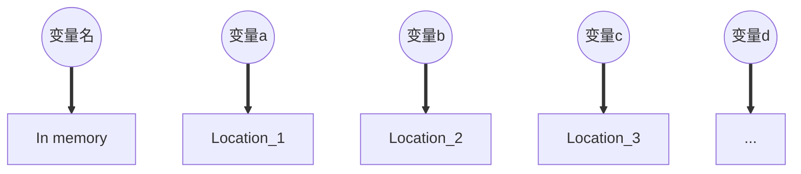
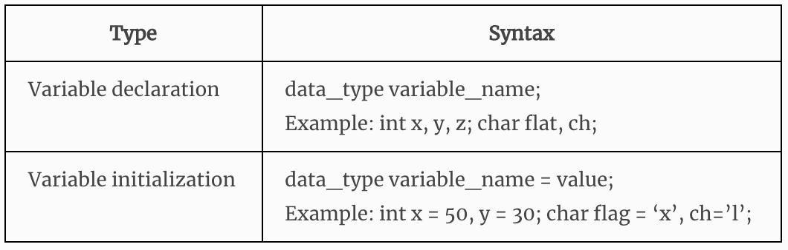

<!--
 * @Descripttion: 
 * @version: 
 * @Author: sch
 * @Date: 2021-07-23 16:58:02
 * @LastEditors: sch
 * @LastEditTime: 2021-07-23 20:41:59
-->
# C Variable
<font color="#ff0ff" size="3">注意区分:</font>
- <font color="red" size="3">Declaring</font> Variables(声明变量)
- <font color="red" size="3">Initialing / Defining</font>  Variables(初始化 / 定义变量)

# 使用C Variable的过程
1. Declaring Variables
2. Allocate memory space
3. Use

# Overview
- `C variable` is a named location in moemory where a program can manipulate the data. This location is used to hold the value of the variable.

- The value of the C variable may get change in the program.
- C variable might be belonging to any of the data type like int, float, char etc.


# 1. DECLARING(声明) & INITIALIZING(初始化) C VARIABLE
- Variable should be `declared` in C program before to `use`.（先声明，后使用）
- `Memory space` is not `allocated` for a variable while <font color="red">declaration</font>. It happens only on variable <font color="red">definition</font>.
- Variable <font color="red">initialization</font> means assigning a value to the variable.



## 错误实例（特别注意）
```c++
#include <stdio.h>

int main(){
    // 声明int型指针a、b，但并未为其分配地址（地址类型占 8个bytes）。
    int *a, *b;
    // 使用前需要分配内存空间，但此处并未分配，而是直接使用
    // 此处并不是对a指针赋值，而是对指针指向的值赋值。指针仍然未被分配内存空间，故而报错。
    *a = 1;
    *b = 2;
    printf("a=%d, b=%d", *a, *b);
    return 0;
}
```
## 正确实例（修改上述错误实例）
```c++
#include <stdio.h>

int main(){
    int *a, *b;
    // malloc()是内存空间分配函数
    a = (int *)malloc(sizeof(int));
    b = (int *)malloc(sizeof(int));
    *a = 1;
    *b = 2;
    printf("a=%d, b=%d\n", a, b);
    return 0;
}
```