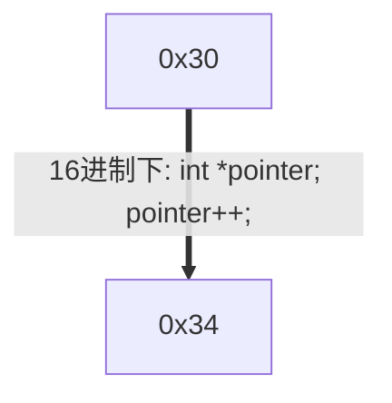
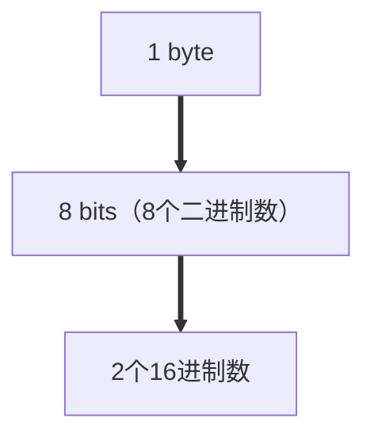

<!--
 * @Descripttion: 
 * @version: 
 * @Author: sch
 * @Date: 2021-07-23 09:59:22
 * @LastEditors: sch
 * @LastEditTime: 2021-07-23 12:20:22
-->
# 1. `void`指针使用规则
## 1.1 `void`指针可以指向任意类型的数据
- <font color="red">无类型</font>可以包含<font color="red">有类型</font>
- <font color="red">有类型</font>不能包含<font color="red">无类型</font>
### 1.1.1 给`void`指针赋值：无需强制类型转换
```c++
int *a;
void *p;
p = a;
```

### 1.1.2 `void`指针赋值给其他指针：需要强制类型转换
如果将`void`指针赋值给其他类型的指针，需要强制类型转换，在上述例子中:`a = (int *)p`。

### 1.1.3 `void`指针在`malloc()`中的应用
内存分配函数`malloc()`返回的就是`void *`类型（void指针）。用户在使用这个指针时，<font color="red" size="3">需要进行强制类型转换</font>，即`(int *)malloc(sizeof(int))`


# 2. 不同标准下的`void`指针
不能直接定义`void`变量，比如`void a;`
- `ANSI C`标准：不允许对`void`指针进行算数运算`p++`或`p+=1`，因为`void`是无类型的，我们不知道每次操作多少个字节。与之相反，我们知道`char`型指针，每次操作`sizeof(char)`个字节；`int`型指针，每次操作`sizeof(int)`个字节。
- `GNU`中：默认情况相下，认为`void *` == `char *`。所以可以进行一系列算数运算操作。

## 2.1 ANSI标准：不能对`void`指针进行算数运算
### 2.1.1 ANSI标准下，对`void`指针进行算数运算
```c++
void *pvoid;
pvoid++;    // 报错（ANSI）：arithmetic on a pointer to void
pvoid += 1; // 报错（ANSI）：arithmetic on a pointer to void
```

### 2.2.2 ANSI标准下，对`int`指针进行算数运算
```c++
#include <stdio.h>

int main(){
    int *pint;
    printf("%p", pint);
    pint++;
    printf("%p", pint);
    return 0;
}
```
Output:
```shell
0x7ffee0ed9970
0x7ffee0ed9974
```
解释：
`int`指针每+1 --> <font color="#ff0ff">移动4个字节</font> --> 16进制表示的地址<font color="#ff00ff">+4</font>


字节与16进制数的关系：



## 2.2 GNU：`void *` == `char *`
```c++
void *pvoid;
pvoid++;    //GNU：正确
pvoid += 1;  //GNU：正确
```