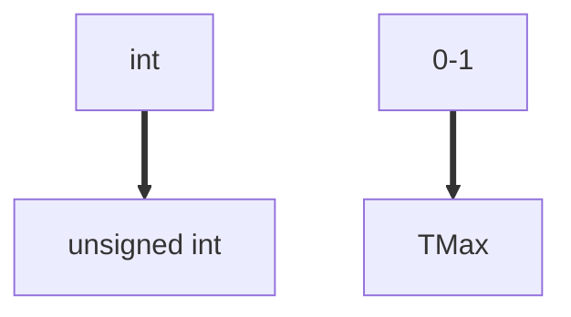

<!--
 * @Descripttion: 
 * @version: 
 * @Author: sch
 * @Date: 2021-07-27 10:17:43
 * @LastEditors: sch
 * @LastEditTime: 2021-07-27 10:58:02
-->
# 隐式的类型强制转换带来的问题：循环永不停止
# 1. 问题描述：利用`unsigned int`进行`i--`计数
```c++
#include <stdio.h>


int main(){
   int cnt = 100;
   size_t i;
   // (cnt-2)等于0时，执行循环体；(cnt-2)等于-1时，(cnt-2)转换为unsigned int，十进制表示为UMax,
   // 所以循环永远停不下来
   for (i=cnt-2; i>=0; i--)
       printf("%lu\n", i);
   return 0;
}
```
Output:
```shell
// 永远停不下来
...
6
5
4
3
2
1
0
18446744073709551615
18446744073709551614
18446744073709551613
18446744073709551612
18446744073709551611
...
```

# 2. 问题解释
<font size="3" color="#ff00ff">关键：一旦越过0，就停不下来了</font>
1. (cnt-2)等于0时，执行循环体；
2. (cnt-2)等于-1时，(cnt-2)转换为unsigned int，十进制表示为UMax, 所以循环永远停不下来

# 3. 程序演示说明
```c++
#include <stdio.h>

typedef unsigned char *byte_pointer;

void show_bytes(byte_pointer start, size_t len);


int main(){
    int x = 0;
    printf("%d:\t", x);
    show_bytes((byte_pointer) &x, sizeof(int));
    unsigned int ux = x;
    printf("%u:\t", ux);
    show_bytes((byte_pointer) &ux, sizeof(unsigned int));
    int y = x - 1;
    printf("%d:\t", y);
    show_bytes((byte_pointer) &y, sizeof(int));
    unsigned int uy = y;
    printf("%u:\t", uy);
    show_bytes((byte_pointer) &uy, sizeof(unsigned int));
    return 0; 
}


void show_bytes(byte_pointer start, size_t len){
    size_t i;
    for (i=0; i<len; i++){
        printf("%.2x ", start[i]);
    }
    printf("\n");
}
```
Output:
```shell
0:      00 00 00 00 
0:      00 00 00 00 
-1:     ff ff ff ff 
4294967295:     ff ff ff ff 
```

# 4. Counting Down With Unsigned
## 4.1 Proper way to use unsigned as loop index
```c++
unsigned i;
for (i=cnt-2; i<cnt; i--)
    // 越过0的时候，(int) -1转换成(unsigned) TMax，循环永不停止
    printf("%u\n", i);
```

## 4.2 Graphic


## 4.3 Even Better
```c++
size_t i;
for (i=cnt-2; i<cnt; i--)
    printf("%u\n", i);
```

1. Data type `size_t` defined as `"%lu"`
2. What if `cnt` is signed and <0?
    - Program can't work, because the loop will continue until overflow（cause segmentation fault）
