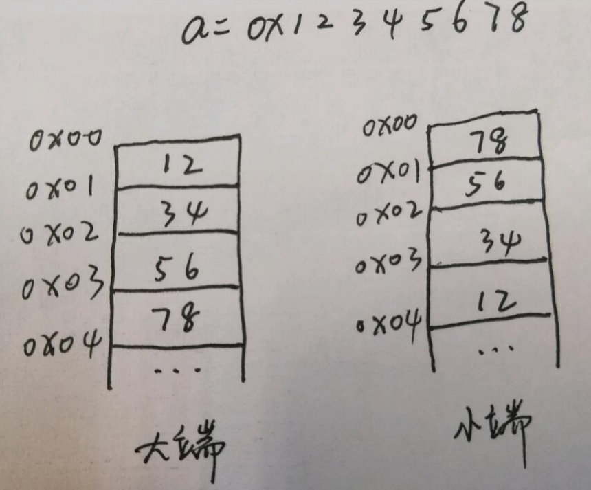

# 1. 大、小端机器的定义


# 2.检验ubuntu20.04 LTS是小端机器
```c++
#include <stdio.h>

typedef unsigned char *byte_pointer;

void show_bytes(byte_pointer start, size_t len);


int main(){
        int a = 0x12345678;
        show_bytes((byte_pointer) &a, sizeof(int));
        return 0;
}


void show_bytes(byte_pointer start, size_t len){
        size_t i;
        for (i=0; i<len; i++){
                printf("%.2x", start[i]);
        }
        printf("\n");
}
```
<font size="5" font-weight="bold">Output:</font>
```shell
78563412
```