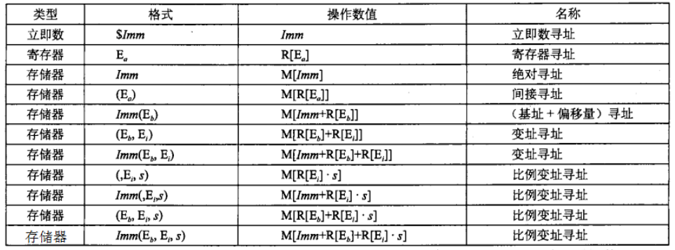

# 1. 操作数格式（Operand Format）
<b>下图见书P121</b>

## 1.1 寻址模式（针对内存）
- `ra`: 表示任意寄存器
- `rb`: 基址寄存器
- `ri`: 变址寄存器
- `寄存器(register)`: R[ ra ]
- `内存(memory)`: M[ Imm + R[rb] + R[ri]*s ]

`Imm(rb, ri, s)`表示的是最常用的形式，由四个部分组成：
1. 一个立即数偏移`Imm`
2. 一个基地址`rb`
3. 一个变地址`ri` 元素索引 * 数组元素占用字节

比如一个字形的数组,它的首地址是6000H,那么它
4. 一个比例因子`s`：必须是1、2、4、8.

<b>有效地址：</b>`Imm` + `R[rb]` + `R[ri]`*`s`
<b>取值：</b>M[Imm + R[rb] + R[ri]*s]

## 1.2 比例因子`s`存在的原因:
想象这是一个数组索引，我们需要按照数据类型的字节数来缩放索引值。e.g. `int -> *4`; `long -> *8`

寻址模式：数组元素地址 = 数组首地址 + 元素索引 * 数组元素占用字节

比如一个字形的数组,它的首地址是6000H,那么它的第4个(索引从0开始)元素的地址就是:
6000H+4*2=6008H

# 2. 操作数的三种类型
- <b>立即数（immediate）</b>：用来表示常数值。在AT&T标准中，立即数的书写方式是`$`后面跟一个用标准C表示法的整数，比如，`$-577`或`$0x1F`
- <b>寄存器（register）</b>：表示某个寄存器的内容。16个寄存器的低位1字节、2字节、4字节、8字节中的一个作为操作数。这些字节数分别对应于8位、16位、32位、64位。用`ra`表示一个寄存器，`R[ra]`表示一个寄存器的值。
- <b>内存（memory）</b>：这类操作数是`内存引用`。会根据`有效地址`访问某个内存位置。