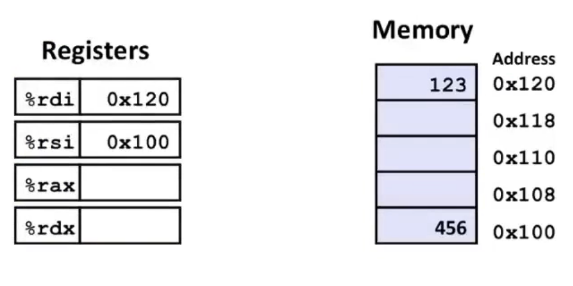

# 数据传送指令
把许多不同的指令划分为`指令类`，每一类中的指令执行相同的操作，只不过操作数大小不同。

# 1. 最简单的数据传送指令--`MOV类`
<font size="3" color="gree"><b>MOV类指令参数：</b></font>
- 第一个参数：源操作数
- 第二个参数：目的操作数
  
| 指令 | 效果 | 描述 |
|:----: | :----: | :----: | 
| MOV S D | S -> D | 传送 |
| movb | | 传送字节 |
| movw | | 传送字 | 
| movl | | 传送双字 |
| movq | | 传送四字 |
| movabsq I R | I -> R | 传送绝对的四字 |

<font size="3" color="red"><b>注意事项：</b></font>
1. MOV指令只会更新目的操作数指定的那些寄存器字节或内存位置。唯一的例外是`movl`指令以寄存器为目的时，它会把该寄存器的高位4字节设置为0。
2. 其他的数据传送指令还有`MOVZ`(零扩展数据传送指令，<font color="red">适用于无符号数</font>)和`MOVS`（符号扩展数据传送指令,<font color="red">适用于有符号数</font>）

# 2. 数据传送示例一
```c++
// mod2.cpp
void swap(long *xp, long*yp){
    long t0 = *xp;
    long t1 = *yp;
    *xp = t1;
    *yp = t0;
}
```
编译:`g++ -Og -S mod2.cpp`
```shell
// mod2.s

...
...

_Z4swapPlS_:
.LFB0:
        .cfi_startproc
        endbr64
        movq    (%rdi), %rax
        movq    (%rsi), %rdx
        movq    %rdx, (%rdi)
        movq    %rax, (%rsi)
        ret
        .cfi_endproc

...
...
```

## 2.1. 汇编代码解析
- 寄存器`%rdi`：存放函数的第一个参数
- 寄存器`%rsi`：存放函数的第二个参数
- 寄存器`%rax`：存放变量t0
- 寄存器`%rdx`：存放变量t1

函数`swap()`参数初始化后，示意图如下：

```shell
movq    (%rdi), %rax    // t0 = 123
movq    (%rsi), %rdx    // t1 = 456
movq    %rdx, (%rdi)    // *xp = t1
movq    %rax, (%rsi)    // *yp = t0
```
<font size="3" color="gree"><b>在解析上述汇编代码运行的过程中，注意：</b></font>
- `%rdi`是寄存器（register），e.g.函数初始化后，`%rdi` = 0x120
- `(%rdi)`是内存（memory），函数初始化后，e.g.`(%rdi)` = 123


# 3. 数据传送示例二
<font color="gree" size="3">局部变量通常是保存在寄存器中，而不是内存中。访问寄存器比访问内存快的多。</font>
```c++
// mod3.cpp

long exchange(long *xp, long y){
    long x = *xp;
    *xp = y;
    return x;
}
```

编译mod3.cpp：`g++ -Og -S mod3.cpp`

```
// mod3.s

...
...
_Z8exchangePll:
.LFB0:
        .cfi_startproc
        endbr64
        movq    (%rdi), %rax
        movq    %rsi, (%rdi)
        // 返回函数被调用点的指令 -- ret
        ret
        .cfi_endproc
...
...
```